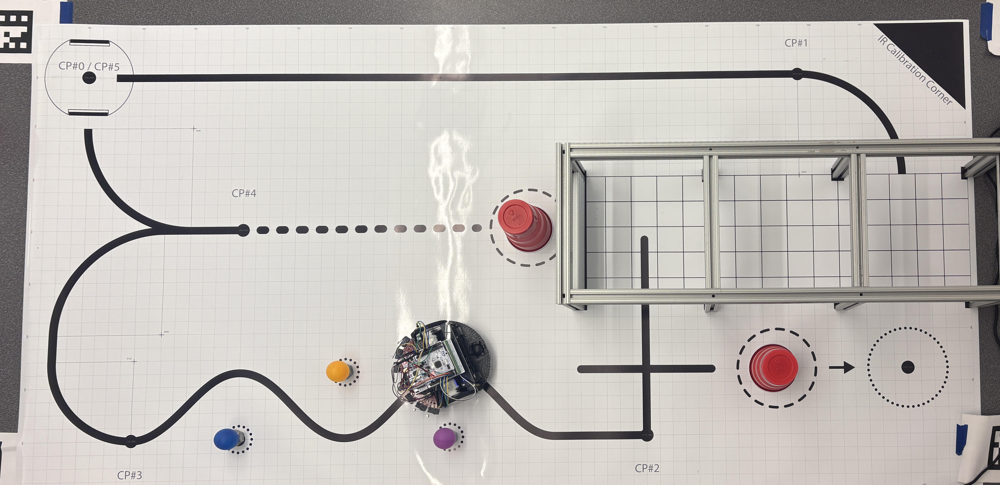

# Term Project

The final project of this class was to combine all of the implemented features and sensors to run the above course. 
Romi starts in the top left corner, follows the long straight, then makes a right turn into the 'garage'. 
The state estimator was used to drive straight in the garage until it hit the wall at the end, this triggered the bump sensor and romi turned left and followed the line, then at the plus turns left again and pushes the red cup from the circle on the dashed circle to the dotted one.
Once the cup is moved the state estimator is again used to return to the course at checkpoint 2. 
Line sensing is re-engaged, and then romi follows the curve, dodging the three ping pong balls, and then following the sweeping curve until it hits checkpoint 4.
Once the dashes following checkpoint four are detected, romi uses the state estimator to turn right slightly and drive forward, then push the cup out of its starting circle.
Finally, it turns around, and returns back to the original starting position.